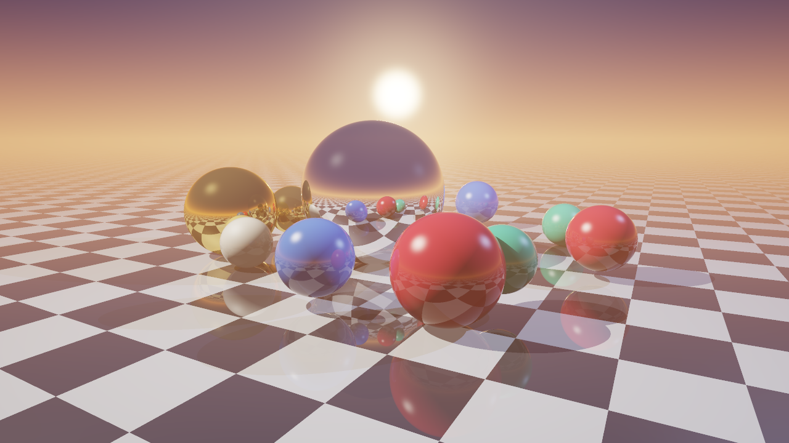
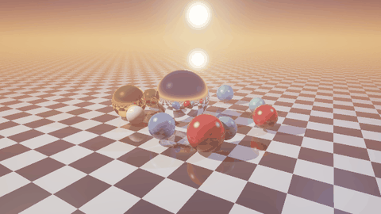

# Python Ray Tracer from Scratch

A physically inspired ray tracer in **~300 lines of pure Python + NumPy** — no 3D engine, no OpenGL, no graphics library. Every pixel is computed by tracing rays of light through the scene and doing the geometry by hand.



<p align="center">
  
</p>

## Features

- **Recursive reflections** — mirrors inside mirrors, up to 5 bounces
- **Fresnel effect** (Schlick approximation) — surfaces grow more reflective at grazing angles
- **Metallic materials** — gold and chrome tint their own reflections
- **Blinn-Phong shading** with specular highlights
- **Hard shadows** from multiple coloured light sources
- **Procedural sky** with a sunset gradient and sun glow
- **Atmospheric fog** that blends distant surfaces into the horizon
- **Anti-aliasing** via supersampling
- **ACES filmic tone mapping** and gamma correction
- **Animation** — orbiting camera and moving objects, exported to MP4 and GIF

## How it's fast

A naive Python ray tracer loops over every pixel and takes hours. This one is **fully vectorised**: all rays in the image (3.7 million at 1280×720 with 2× supersampling) are represented as NumPy arrays and traced *simultaneously*. Each reflection bounce only continues the rays that still carry meaningful light.

| Output | Resolution | Time* |
|---|---|---|
| Still image | 1280×720, 2× SSAA | ~23 s |
| Animation frame | 640×360, 2× SSAA | ~4.5 s |

<sub>*Measured on a 2-core cloud machine.</sub>

## How it works

1. **Camera** — for each pixel, build a ray from the eye through the image plane.
2. **Intersection** — solve the ray–sphere quadratic and the ray–plane equation for every object; keep the nearest hit.
3. **Shading** — for each light, cast a shadow ray; if unblocked, add diffuse and specular light.
4. **Reflection** — mirror the ray about the surface normal, weight it by the Fresnel term, and trace again.
5. **Post-processing** — average supersamples, apply vignette, tone map, gamma correct.

## Run it

```bash
pip install -r requirements.txt

python raytracer.py                      # render.png at 1280x720
python raytracer.py --width 1920 --height 1080 --ss 3   # higher quality
python raytracer.py --animate            # also orbit.mp4 and orbit.gif
```

## Possible extensions

- Glass and refraction (Snell's law)
- Soft shadows with area lights
- Triangle meshes and loading `.obj` models
- Path tracing for global illumination
